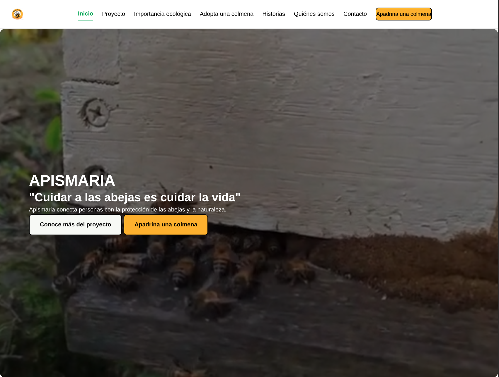

# Apismaria Website

Proyecto web sobre protección de abejas y apicultura sostenible.

## Tecnologías

- HTML
- CSS
- JavaScript

## Características

- Diseño responsive
- Animaciones reveal
- Formularios interactivos
- Galería de imágenes
- Navbar dinámico

## Sitio web

https://tuusuario.github.io/apismaria-website

## Vista del proyecto

## Autor

Nicolas Escobar Pulido
